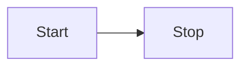

# Markdown后处理
---
如果想改变 Markdown 文档在阅读视图中的呈现方式，可以添加自己的 Markdown 后处理器。正如其名称所示，后处理器在 Markdown 处理成 HTML 后运行。它可以让你添加、移除或替换渲染文档中的 [HTML元素](../user-interface/html-elements.md)。

下面的示例会查找两个`:`之间文本，并将其替换为相应的表情符号：

```ts
import { Plugin } from "obsidian";

const ALL_EMOJIS: Record<string, string> = {
  ":+1:": "👍",
  ":sunglasses:": "😎",
  ":smile:": "😄",
};

export default class ExamplePlugin extends Plugin {
  async onload() {
    this.registerMarkdownPostProcessor((element, context) => {
      const codeblocks = element.findAll("code");

      for (let codeblock of codeblocks) {
        const text = codeblock.innerText.trim();
        if (text[0] === ":" && text[text.length - 1] === ":") {
          const emojiEl = codeblock.createSpan({
            text: ALL_EMOJIS[text] ?? text,
          });
          codeblock.replaceWith(emojiEl);
        }
      }
    });
  }
}
```

## 后处理 Markdown 代码块


您知道吗，在Obsidian 中创建一个 `mermaid` 代码块，就可以创建 [Mermaid](https://mermaid-js.github.io/) 图？

````md

````

如果切换到预览模式，代码块中的文本就会变成下图：


如果你想添加类似Mermaid的自定义代码块，可以使用 [registerMarkdownCodeBlockProcessor()](https://docs.obsidian.md/Reference/TypeScript+API/Plugin/registerMarkdownCodeBlockProcessor)。下面的示例以表格的形式呈现了一个包含 CSV 数据的代码块：

```ts
import { Plugin } from "obsidian";

export default class ExamplePlugin extends Plugin {
  async onload() {
    this.registerMarkdownCodeBlockProcessor("csv", (source, el, ctx) => {
      const rows = source.split("\n").filter((row) => row.length > 0);

      const table = el.createEl("table");
      const body = table.createEl("tbody");

      for (let i = 0; i < rows.length; i++) {
        const cols = rows[i].split(",");

        const row = body.createEl("tr");

        for (let j = 0; j < cols.length; j++) {
          row.createEl("td", { text: cols[j] });
        }
      }
    });
  }
}
```

